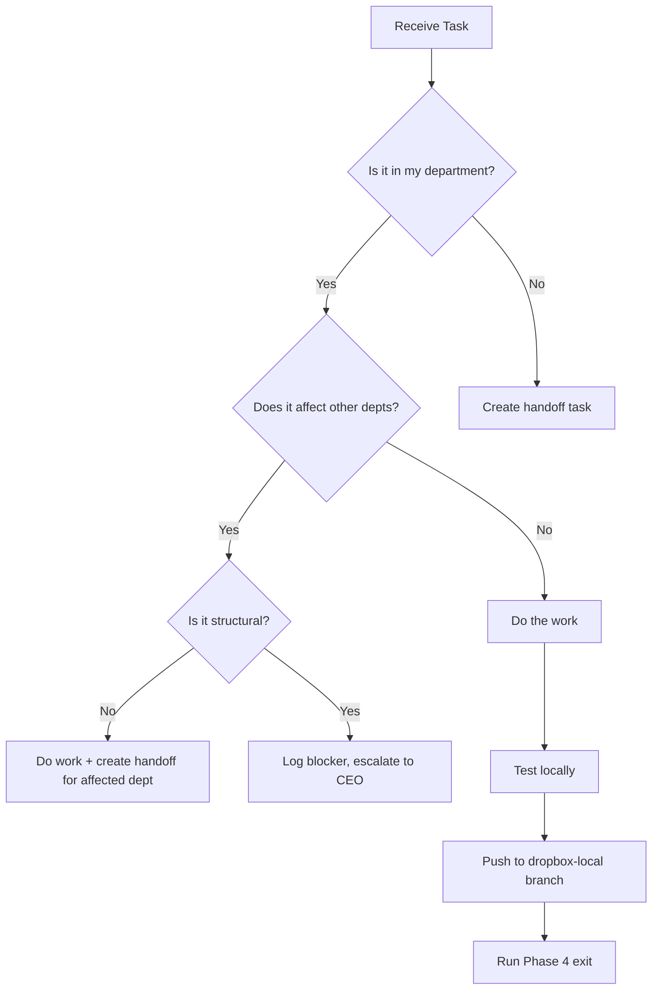

# AI Operating Guide

> Instructions for Claude sessions (Cowork or Scheduled) interacting with the Casper Factory.

## Session Start — Read Order (MANDATORY)

Every session MUST read these files in this order before doing any work:

### 1. CLAUDE.md (project rules)
Location: Casper-Code repo root or `/sessions/*/mnt/*/CasperVPN/Code/Casper-Code/CLAUDE.md`
Contains: Git workflow, credentials, department protocols, security rules.

### 2. DEPARTMENT_LOG.md (cross-dept comms)
Location: Casper-Code repo root
Contains: Recent session summaries from all departments. Check what changed.

### 3. Dashboard data.json (task queue)
Location: Dashboard- repo root
Contains: Department status, crossDeptTasks, importantNotes.
Check: Your department's status, pending handoffs, blockers.

### 4. Your Department SKILL.md
Location: `/sessions/*/mnt/Scheduled/<dept-task>/SKILL.md`
Contains: Phase 0-4 workflow specific to your department.

### 5. system/DONTS.md (guardrails)
Location: Dashboard- repo `system/DONTS.md`
Contains: Anti-patterns and change advisory protocol.

## Phase Execution

```
Phase 0: vault_sync() → ensures Obsidian has fresh data
Phase 1: dept_check.py → shows status + pending handoffs
Phase 2: Load context (skill + CLAUDE.md + dept log)
Phase 3: Do actual work
Phase 4: dept_exit.py → logs to all memory locations + vault sync
```

## Decision Framework

When asked to make a change, follow this logic:



## Verification Steps

After completing work, verify:
1. `python3 session_start.py <dept>` — does it show your updates?
2. Dashboard live site — do your changes render correctly?
3. `dept_exit.py` — did it write to all 4 log locations?
4. No errors in console/output

## Error Recovery

| Error | Cause | Fix |
|-------|-------|-----|
| `vault_sync() No local clone found` | VM mount not available | API still works; Obsidian updates on next manual sync |
| `409 Conflict` on API push | Stale SHA | Re-fetch file, get new SHA, retry push |
| `TypeError` in dashboard | Missing required field | Check data.json schema in DASHBOARD-LOGIC.md |
| `.git/index.lock` | Interrupted git operation | vault_sync() auto-removes .lock files |
| Phase 1 shows wrong data | Stale local cache | Run Phase 0 vault sync first |

## Session Types

| Type | Trigger | Duration | Tools |
|------|---------|----------|-------|
| Scheduled | Cron timer | ~5-15 min | Factory scripts only |
| Cowork | User request | Variable | Full tool access |
| CEO Review | Manual | Variable | Full access + green verification |

## Memory Architecture

```
Brain (Obsidian Vault)
  └── projects/caspervpn/
        ├── code → symlink to Casper-Code/memory
        └── dashboard → symlink to Dashboard-/system

Casper-Code (GitHub: dropbox-local branch)
  └── memory/
        ├── departments/<dept>/session-log.md
        └── sessions/<date>-factory-sessions.md

Dashboard- (GitHub: main branch)
  └── system/
        ├── INDEX.md (this wiki entry point)
        ├── ARCHITECTURE.md
        ├── DASHBOARD-LOGIC.md
        ├── SESSION-CHAIN-LOG.md
        ├── DONTS.md
        └── AI-OPERATING-GUIDE.md (this file)
```