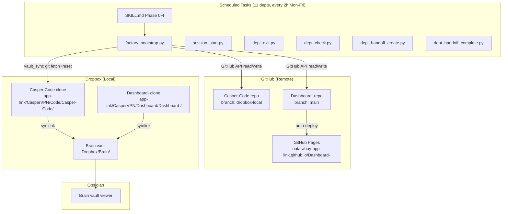
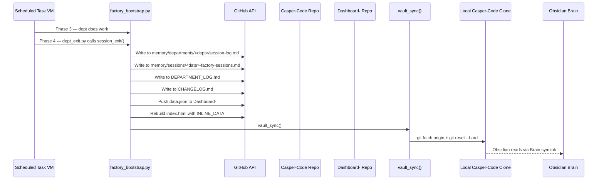
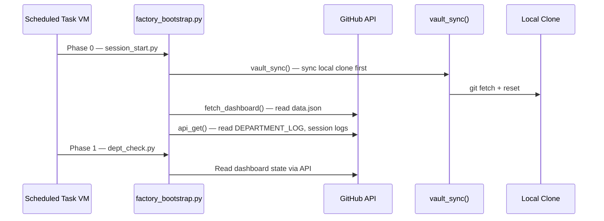
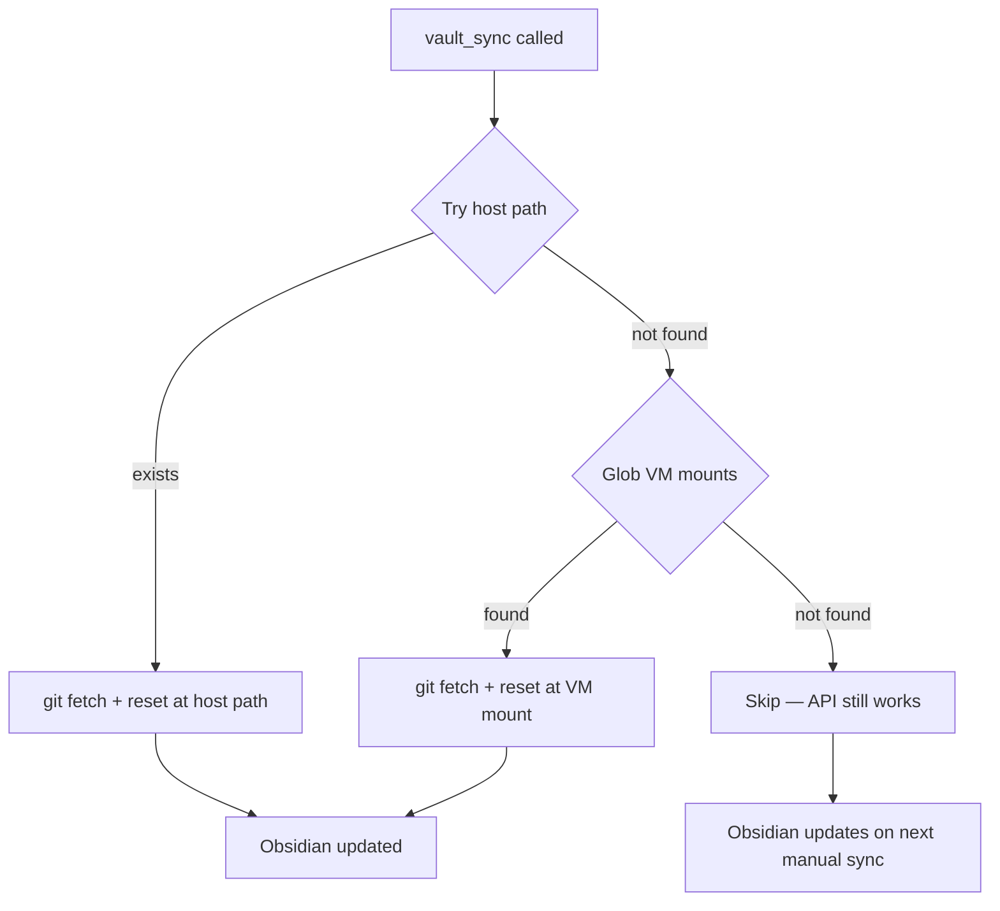
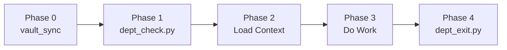

# System Architecture

## Overview Diagram

## Data Flow — Write Path

## Data Flow — Read Path

## Technologies by Layer

| Layer | Technology | Purpose |
|-------|-----------|---------|
| Scheduled Tasks | Claude Cowork Scheduled Tasks | Cron-triggered AI sessions |
| Factory Scripts | Python 3 | API orchestration, vault sync |
| GitHub API | GitHub Contents API v3 | Read/write files without git clone |
| Git Sync | Git (fetch + reset) | Keep local clone in sync |
| Dashboard | HTML + Vanilla JS | Single-page dashboard with INLINE_DATA |
| Dashboard Hosting | GitHub Pages | Static hosting, auto-deploy on push |
| Obsidian Vault | Markdown + Symlinks | Cross-project knowledge browsing |
| Storage | Dropbox | File sync across devices |

## vault_sync() — Multi-Strategy

Host path: `/Users/omar/Dropbox/app-link/CasperVPN/Code/Casper-Code`
VM mount patterns: `/sessions/*/mnt/*/CasperVPN/Code/Casper-Code`
Timeout: 60 seconds per operation.
Deduplication: Candidates resolved by `os.path.realpath()` before attempting.

## Session Lifecycle — 5 Phases

| Phase | Script | What Happens |
|-------|--------|-------------|
| 0 | session_start.py | vault_sync() syncs local clone, then shows dashboard state |
| 1 | dept_check.py | Reads dashboard via API, shows dept status + pending handoffs |
| 2 | (manual) | Load department SKILL + CLAUDE.md + DEPARTMENT_LOG |
| 3 | (work) | Execute tasks, complete/create handoffs via factory scripts |
| 4 | dept_exit.py | session_exit() writes to 4 vault locations + dashboard + vault_sync |

## Cowork vs Scheduled Sessions

| Aspect | Scheduled Task | Cowork Session |
|--------|---------------|----------------|
| Trigger | Cron (every 2h Mon-Fri) | Manual (user opens Cowork) |
| VM | Fresh VM, no persistent state | VM with mounted folders |
| Dropbox access | No (API only) | Yes (mounts available) |
| vault_sync | Tries host path (fails), tries VM mounts (fails), skips | Tries host path, tries VM mounts (succeeds) |
| API access | Always works | Always works |
| Session logging | Same pipeline (dept_exit.py) | Same pipeline (session_exit) |

---
*Last updated: 2026-03-11*
